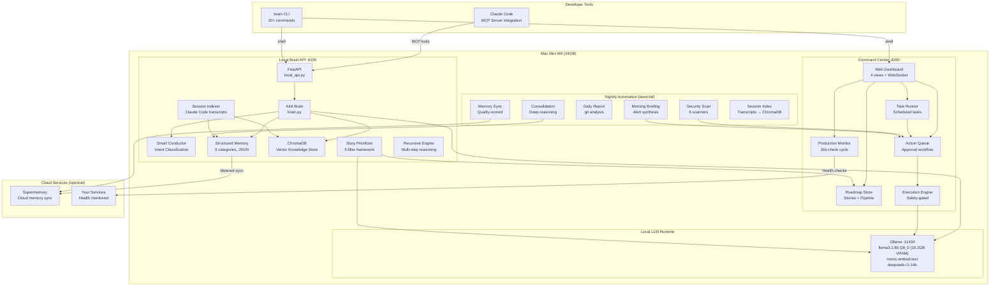
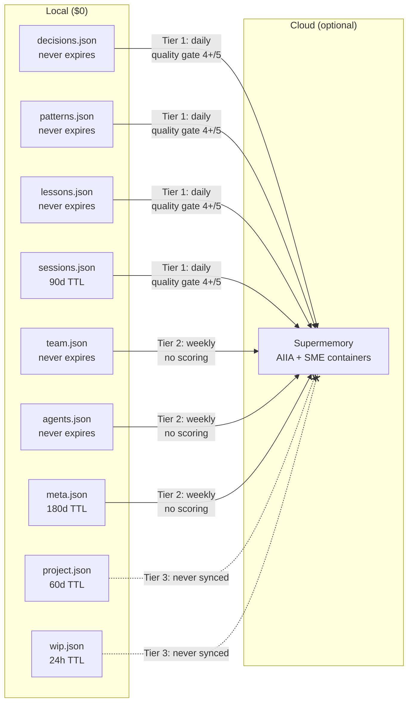
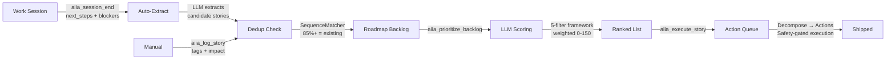
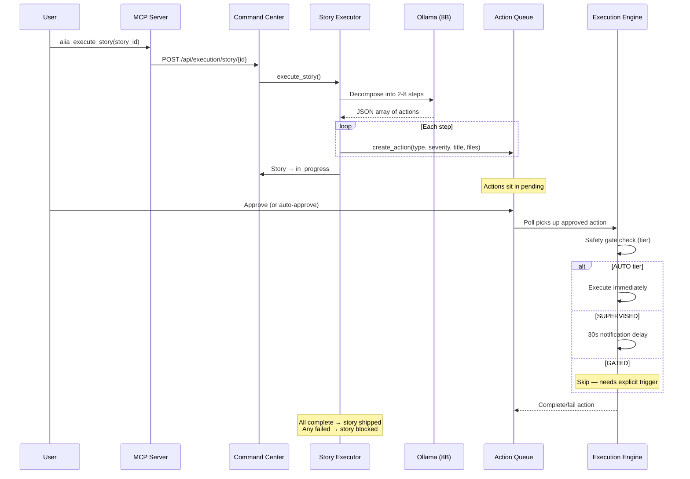

# AIIA — AI Information Architecture

> Persistent AI runtime layer for development teams. Runs on Apple Silicon with local LLM reasoning, structured memory, autonomous task scheduling, story capture & prioritization, production monitoring, and MCP integration with Claude Code.

**Hardware:** Mac Mini M4 (or any Apple Silicon with 24GB+ RAM)
**Status:** Production-ready (since February 2026)
**License:** Apache 2.0

---

## What Is AIIA?

AIIA is a **persistent AI teammate** that runs on dedicated hardware alongside your cloud services. Unlike ephemeral AI chat sessions, AIIA:

- **Never forgets** — 9-category structured memory with tiered cloud sync
- **Works while you sleep** — Nightly security scans, memory consolidation, report generation
- **Integrates with your IDE** — MCP tools for Claude Code (session context, memory, prioritization)
- **Reasons locally for free** — Routes simple tasks to Ollama ($0), complex ones to Claude/Gemini
- **Monitors production** — Health checks, alert synthesis, morning briefings

---

## Architecture Overview



---

## System Components

### Local LLM Stack

| Model | Role | Quantization | VRAM | Context | Temp | Max Tokens |
|-------|------|-------------|------|---------|------|------------|
| `llama3.1:8b-instruct-q8_0` | Routing, tasks, PII | Q8_0 (near-lossless) | ~10.2GB | 16K | 0.1-0.7 | 256-4096 |
| `nomic-embed-text` | Embeddings (RAG) | Native | ~0.5GB | — | — | — |
| `deepseek-r1:14b` | Deep reasoning (nightly) | Full | ~9GB | 8K | 0.6 | 8192 |

**Ollama Configuration:**
- `keep_alive: 30m` — Model stays warm between requests
- `num_batch: 512` — Parallel processing batch size
- `num_gpu: 99` — Full GPU offload
- VRAM headroom: ~14GB free after primary model loaded

### Memory System

Two-layer architecture: local JSON (instant, free) + optional Supermemory cloud (persistent, metered).



**Memory Entry Structure:**
```json
{
  "id": "decisions_42_2026-03-12T15:00:00Z",
  "fact": "The fact to remember",
  "source": "claude-code|session|bootstrap",
  "created_at": "2026-03-12T15:00:00Z",
  "metadata": {}
}
```

**Metered Sync Pipeline:**
- Budget: configurable tokens/month and tokens/day caps
- Quality gate: local LLM scores each memory 1-5, only 4+ synced
- Dedup: SHA256 content hash prevents re-syncing
- Circuit breaker: halts after 5 consecutive API errors

### Knowledge Store (ChromaDB)

- **Collection:** configurable via `AIIA_COLLECTION_NAME` (default: `aiia_knowledge`)
- **Chunking:** 1,500 chars max, 200 char overlap, paragraph-aware breaks
- **Chunk IDs:** Deterministic SHA256 hash
- **Bootstrap:** Index your repo's docs, code, and config files

### Smart Conductor (Intent Classification)

Replaces keyword matching with LLM-powered routing:

```
Query → SmartConductor → {domain, eq_level, complexity_score, recommended_path}
```

| Complexity | Path | Handler | Cost |
|-----------|------|---------|------|
| 0.0-0.3 | `local` | Ollama (local) | $0 |
| 0.3-0.6 | `eos` | Single Claude call | ~$0.01 |
| 0.6-1.0 | `rlm` | Agentic loop (multi-step) | ~$0.10+ |

**Domains:** Finance, Legal, Compliance, Document, Memory, Crisis, Estate, Marketing, Social, General
**EQ Levels:** Fibonacci-scaled (1, 2, 3, 5, 8, 13, 21) — ANALYST through EMERGENCY

---

## Story Capture & Prioritization

### The Loop



### 5-Filter Priority Framework

Every backlog story is scored against configurable business-impact filters (0-10 each, weighted). Default filters:

| Filter | Weight | Question |
|--------|--------|----------|
| Closes Deal | 5x | Does this help close an active sales opportunity? |
| Retains Client | 4x | Does this fix a bug, improve UX, or add a feature for a paying client? |
| Reduces Cost | 3x | Does this reduce token spend, infra cost, or manual overhead? |
| Enables Platform | 2x | Does this improve the platform for all products? |
| New Revenue | 1x | Does this create a new revenue stream? |

Filters are fully customizable — edit `story_prioritizer.py` to match your business priorities.

**Max Score:** 150 (all filters at 10)
**Priority Mapping:** P0 >= 90 | P1 >= 50 | P2 >= 25 | P3 < 25

---

## Autonomous Task System

### Scheduled Tasks

| Task | Schedule | LLM | Purpose |
|------|----------|-----|---------|
| `health_journal` | Every 1h | No | Service health snapshots → AIIA memory |
| `ci_monitor` | Every 30m | No | CI/CD pipeline checks |
| `code_health` | Every 3h | No | Lint, test, dependency analysis |
| `security_scan` | Every 6h | No | 6-scanner security suite |
| `repo_sync` | Every 6h | No | Re-index repo into ChromaDB |
| `learning_loop` | Every 4h | Yes | Extract insights from recent actions |
| `test_runner` | Every 4h | No | Run test suite |
| `cross_tenant_analytics` | Daily 3am | Yes | Cross-project pattern analysis |
| `memory_digest` | Daily 6am | Yes | Memory consolidation digest |
| `daily_brief` | Daily 8am | Yes | Morning briefing generation |
| `weekly_status` | Every 7 days | Yes | Weekly client health report |

### Nightly Automation (launchd)

Configure launchd agents for background automation:

| Time | Purpose | What |
|------|---------|------|
| 12:00am | Security scan | 6 scanners: bandit, semgrep, trivy, trufflehog, shellcheck, hadolint |
| Every 4h | Memory sync | Quality-scored sync: local memory → Supermemory cloud |
| 2:30am | Daily report | Git log analysis grouped by product |
| 3:00am | Consolidation | DeepSeek R1 memory consolidation (themes, contradictions, stale) |
| 4:30am | Briefing | DeepSeek R1 alert synthesis from overnight reports |
| 5:30am | Session index | Claude Code JSONL transcripts → ChromaDB + memory |
| Every 3h | Interval report | Code shipping windows |
| Always | Brain API | KeepAlive: auto-restart Brain API + Command Center |

### Action Queue

**Lifecycle:**
```
pending → approved → executing → completed
       ↘ rejected (terminal)
       ↘ expired (72h auto)
                           ↘ failed (terminal)
```

**Action Types:** lint_fix, test_fix, security_fix, ci_fix, review, tech_debt, post_commit_review, verify_lint, verify_test, verify_security, commit

**Safety Tiers:**

| Tier | Auto-Execute | Actions |
|------|-------------|---------|
| AUTO | Yes | lint_fix, verify_test, verify_lint, verify_security |
| SUPERVISED | 30s delay | test_fix, tech_debt, commit |
| GATED | Manual only | security_fix (critical/error), review |

**Forbidden Files:** `.env*`, `*.pem`, `*.key`, `*/migration/*` — configurable in `execution/safety.py`

---

## Execution Engine

### Story Execution Flow



### Execution Strategies

| Strategy | Used For | Timeout | Method |
|----------|----------|---------|--------|
| DirectFixStrategy | lint_fix, dep bumps | 120s | `ruff check --fix` + `ruff format` |
| ClaudeCodeStrategy | Complex code changes | 600s | Claude CLI on `aiia/*` branch |
| CommitStrategy | Git commits | 60s | `git add` + `git commit` |

---

## MCP Integration (Claude Code)

Configure in your project's `.mcp.json` (see [`../.mcp.json`](../.mcp.json) for a template):

```json
{
  "mcpServers": {
    "aiia": {
      "command": "/path/to/venv/bin/python3",
      "args": ["-m", "local_brain.mcp_server"],
      "cwd": "/path/to/AIIA",
      "env": { "EQ_BRAIN_DATA_DIR": "/path/to/.aiia/eq_data" }
    }
  }
}
```

### Available Tools

| Tool | Purpose |
|------|---------|
| `aiia_ask` | Search knowledge + memory + LLM reasoning |
| `aiia_remember` | Store fact in persistent memory |
| `aiia_search` | Fast vector search (no LLM) |
| `aiia_status` | Health + stats check |
| `aiia_session_start` | Load context at session start |
| `aiia_session_end` | Record summary + auto-extract stories |
| `aiia_save_wip` | Preserve work-in-progress state |
| `aiia_log_story` | Capture story to backlog (with dedup) |
| `aiia_prioritize_backlog` | Score backlog via 5-filter framework |
| `aiia_execute_story` | Decompose story into actions |
| `aiia_story_progress` | Check execution progress |
| `aiia_briefing` | Get/generate morning briefing |
| `aiia_ops_status` | Production health check |
| `aiia_tokens_today` | Token usage and costs |
| `aiia_what_was_i_doing` | Quick context catch-up |

### Session Protocol

```python
# START — Load context before work
aiia_session_start(task_description="What you're working on", branch="feat/xyz")

# DURING — Capture decisions and learnings
aiia_remember(fact="Chose X over Y because...", category="decisions")
aiia_log_story(title="Refactor auth middleware", tags=["tech-debt"])

# END — Preserve state for next session
aiia_save_wip(description="Halfway through auth refactor", next_steps=["Finish token validation"])
aiia_session_end(
    session_id="unique-id",
    summary="Refactored auth middleware",
    key_decisions=["Switched to jose library"],
    next_steps=["Add refresh token rotation"],
    blockers=["Need staging access"]
)
# ^ Auto-extracts stories from next_steps/blockers
```

---

## Command Center Dashboard

**URL:** `http://localhost:8200`

### Views

| View | URL | Purpose |
|------|-----|---------|
| Console | `/` | System status, routing stats, AIIA health, token tracking |
| Work | `/work` | Kanban board, check-in, activity, actions, prioritization |
| Voice | `/voice` | Voice interface with macOS TTS |
| Ops | `/old` | Operations view |

### Work Dashboard Tabs

- **Check-in:** WIP, active/blocked stories, pending actions, commits, pipeline, "What to Build Next" (priority scoring)
- **Board:** Kanban (5 columns), drag-drop status changes, product/priority filters, "Prioritize" button
- **Activity:** Commits, heatmap, projects, uncommitted changes, daily report
- **Actions:** Pending action queue with approve/reject, severity filters

### API Endpoints (111 total — 74 server.py + 37 local_api.py)

<details>
<summary>Full endpoint list</summary>

**Pages:** GET `/`, `/old`, `/work`, `/voice`, WebSocket `/ws`

**Platform:** GET `/api/platform`, `/api/summary`, `/api/aiia`, `/api/health`

**Monitor:** GET `/api/monitor`, `/api/monitor/{service_id}`

**Tasks:** GET `/api/tasks`, `/api/tasks/history` | POST `/api/tasks/{id}/run`

**Actions:** GET `/api/actions`, `/api/actions/summary` | POST `/api/actions`, `/api/actions/{id}/approve`, `/api/actions/{id}/reject`, `/api/actions/{id}/complete`

**Reports:** GET `/api/briefing/latest`, `/api/reports/today`, `/api/reports/today-md`, `/api/reports`, `/api/reports/{date}`, `/api/reports/interval/latest` | POST `/api/briefing/generate`, `/api/reports/generate`, `/api/reports/interval`

**Metrics:** GET `/api/routing/stats`, `/api/routing/recent`, `/api/insights`, `/api/tokens/today`, `/api/tokens/recent` | POST `/ops/record-token-usage`, `/ops/record-latency`, `/ops/record-routing`

**Memory & Chat:** GET `/api/memories`, `/api/chat/history` | DELETE `/api/memories/{id}`, `/api/chat/history`, `/api/chat/history/{index}` | PUT `/api/chat/history/{index}` | POST `/api/chat`, `/api/chat/stream`, `/api/chat/stop`, `/api/tts`, `/api/voice`, `/api/speak`, `/api/speak/stop`

**Roadmap:** GET `/api/roadmap`, `/api/roadmap/similar/{title}`, `/api/roadmap/summary` | POST `/api/roadmap`, `/api/roadmap/extract`, `/api/roadmap/prioritize` | PUT `/api/roadmap/{id}` | DELETE `/api/roadmap/{id}`

**Pipeline:** GET `/api/pipeline` | POST `/api/pipeline` | PUT `/api/pipeline/{id}` | DELETE `/api/pipeline/{id}`

**Execution:** GET `/api/execution/status`, `/api/execution/log`, `/api/execution/story/{id}/progress` | POST `/api/execution/kill`, `/api/execution/execute/{id}`, `/api/execution/story/{id}`

**Work Context:** GET `/api/work/context`, `/api/checkin`, `/api/syntax`

</details>

---

## Brain CLI

```bash
brain start          # Start Ollama + Brain API + Command Center
brain stop           # Stop all services
brain restart        # Clean stop then start
brain status         # Service status + AIIA health

brain report         # Today's shipped code report
brain report 2026-03-10  # Report for specific date
brain report --interval  # 3-hour interval report

brain scan           # Full 6-scanner security suite
brain scan -q        # Quick scan (secrets + deps only)

brain sync           # Metered memory sync (local → cloud)
brain sync -w        # Weekly mode (includes Tier 2)

brain consolidate    # Deep memory consolidation (DeepSeek R1)
brain briefing       # Morning briefing (alert synthesis)
brain morning        # One-shot catch-up (nightly jobs + WIP + stories)
brain morning -v     # With voice output

brain chat           # Interactive AIIA chat
brain chat -v        # With voice

brain session-index  # Index Claude Code transcripts
brain commits        # Extract intelligence from git commits

brain idea "Title" product  # Quick-capture to backlog
brain actions list          # View pending actions
brain actions approve ID    # Approve action
brain actions reject ID "reason"

brain test platform  # Run platform tests
brain logs           # Recent logs
brain logs -f        # Follow logs
brain logs err       # Error logs
brain pull           # Git pull latest code
brain help           # All commands
```

---

## Directory Structure

```
AIIA/
├── local_brain/
│   ├── local_api.py                # FastAPI :8100 (main API)
│   ├── config.py                   # LocalBrainConfig dataclass
│   ├── ollama_client.py            # Ollama HTTP client
│   ├── smart_conductor.py          # LLM intent classification
│   ├── mcp_server.py               # MCP tools for Claude Code
│   │
│   ├── eq_brain/                   # AIIA Core Intelligence
│   │   ├── brain.py                # AIIA class (main brain)
│   │   ├── memory.py               # Structured JSON memory
│   │   ├── knowledge_store.py      # ChromaDB wrapper
│   │   ├── supermemory_bridge.py   # Cloud sync (Supermemory SDK)
│   │   ├── memory_sync.py          # Metered sync + TokenLedger
│   │   ├── memory_consolidator.py  # Deep reasoning consolidation
│   │   ├── story_prioritizer.py    # 5-filter scoring engine
│   │   ├── session_indexer.py      # Claude Code transcript → ChromaDB
│   │   ├── morning_briefing.py     # Alert synthesis
│   │   ├── recursive_engine.py     # Multi-step recursive reasoning
│   │   ├── repl_env.py             # Variable-based exploration
│   │   └── bootstrap.py            # Knowledge indexing
│   │
│   ├── command_center/             # Web Dashboard :8200
│   │   ├── server.py               # FastAPI + WebSocket
│   │   ├── aiia_tasks.py           # Task scheduling
│   │   ├── action_queue.py         # Action lifecycle
│   │   └── static/                 # Dashboard HTML/JS
│   │       ├── console.html        # Console view
│   │       ├── work.html           # Kanban + prioritization
│   │       └── voice.html          # Voice interface
│   │
│   ├── execution/                  # Safety-gated execution
│   │   ├── executor.py             # ExecutionEngine
│   │   ├── safety.py               # SafetyGate + tier mapping
│   │   ├── strategies.py           # Direct, Claude, Commit
│   │   ├── story_executor.py       # Story → action decomposition
│   │   ├── verification.py         # Post-execution checks
│   │   ├── subprocess_pool.py      # Subprocess management
│   │   ├── execution_log.py        # Execution history
│   │   ├── git_ops.py              # Git operations
│   │   └── chains.py               # Action chaining
│   │
│   ├── scripts/                    # Utilities
│   │   ├── roadmap_store.py        # Story CRUD + dedup
│   │   ├── pipeline_store.py       # Deal pipeline CRUD
│   │   ├── daily_report.py         # Git report generator
│   │   └── memory_sync_runner.py   # CLI for brain sync
│   │
│   └── pilot/                      # Setup scripts
│       └── start_brain.sh          # Startup script
│
├── .env.example                    # Environment variable template
├── requirements.txt                # Python dependencies
├── Dockerfile                      # Container build
├── docker-compose.yml              # Full stack (AIIA + Ollama)
├── .gitignore
├── CONTRIBUTING.md
├── LICENSE                         # Apache 2.0
└── README.md                       # This file
```

**Data directory** (`~/.aiia/eq_data/` by default, configurable via `EQ_BRAIN_DATA_DIR`):

```
~/.aiia/eq_data/
├── memory/                         # 9 JSON memory files
├── chroma/                         # ChromaDB vector store
├── roadmap/stories.json            # Kanban stories
├── sync/                           # Sync state + token ledger
├── reports/                        # Daily/weekly reports
├── execution/                      # Execution logs
├── session_index/                  # Session memory index
└── trajectories/                   # Agent execution traces
```

---

## Configuration

### Environment Variables

| Variable | Default | Purpose |
|----------|---------|---------|
| `LOCAL_LLM_URL` | `http://localhost:11434` | Ollama endpoint |
| `LOCAL_BRAIN_HOST` | `0.0.0.0` | Brain API listen address |
| `LOCAL_BRAIN_PORT` | `8100` | Brain API port |
| `LOCAL_ROUTING_MODEL` | `llama3.1:8b-instruct-q8_0` | Conductor model |
| `LOCAL_TASK_MODEL` | `llama3.1:8b-instruct-q8_0` | Task/extraction model |
| `LOCAL_EMBED_MODEL` | `nomic-embed-text` | Embedding model |
| `LOCAL_DEEP_MODEL` | `deepseek-r1:14b` | Nightly deep reasoning |
| `EQ_BRAIN_DATA_DIR` | `~/.aiia/eq_data` | Data directory |
| `EXECUTION_ENABLED` | `false` | Enable execution engine |
| `SUPERMEMORY_API_KEY` | — | Supermemory cloud access (optional) |
| `SUPERMEMORY_ENABLED` | `true` | Cloud sync kill switch |
| `SUPERMEMORY_TIMEOUT` | `8.0` | Per-call timeout (seconds) |
| `ANTHROPIC_API_KEY` | — | Claude API (for Claude strategy) |
| `GOOGLE_API_KEY` | — | Google TTS (optional) |
| `AIIA_CONTAINER_PREFIX` | `aiia` | Supermemory container prefix |
| `AIIA_PRODUCTS_CONFIG` | — | JSON file with product registry |
| `AIIA_SME_CONFIG` | — | JSON file with SME domain containers |

### Key Limits

| Parameter | Value | Purpose |
|-----------|-------|---------|
| Context window | 16,384 tokens | Ollama `num_ctx` |
| Output tokens | 3,072 | Max generation per request |
| Recursive iterations | 15 | RLM max loop count |
| Recursive token budget | 50,000 | RLM session cap |
| Sync daily budget | 200,000 tokens | Supermemory daily cap |
| Sync monthly budget | 3,000,000 tokens | Supermemory monthly cap |
| Execution timeout | 600s | Max per-action execution |
| Execution max retries | 2 | Retry count before failing |
| Execution concurrency | 1 | Max simultaneous actions |
| Monitor check interval | 30s | Production health polling |
| Scheduler interval | 10s | Task due-check frequency |
| Knowledge chunk size | 1,500 chars | ChromaDB chunk max |
| Knowledge chunk overlap | 200 chars | Cross-chunk context |

---

## Production Monitor

Monitors configurable services with health checks every 30 seconds (24-hour history retention).

Configure monitored services via `AIIA_PRODUCTS_CONFIG` JSON file or edit `_DEFAULT_PRODUCTS` in `command_center/server.py`.

**Default services:**

| Service | Check URL | Timeout | Category |
|---------|-----------|---------|----------|
| AIIA Local Brain | `localhost:8100/v1/aiia/status` | 5s | intelligence |
| Ollama | `localhost:11434/api/tags` | 3s | local |

Add your own production services (backends, APIs, databases) to the products config.

**Status Values:** online, degraded (slow/4xx), offline (timeout/5xx/error)

---

## Security

### 6-Scanner Suite (Nightly)

| Scanner | What | Fail Condition |
|---------|------|----------------|
| trufflehog | Secret detection | Any secrets found |
| trivy | CVE scanning (pip/npm) | Critical severity |
| bandit | Python SAST | High severity |
| semgrep | Pattern-based security | Error-level findings |
| shellcheck | Shell script analysis | Errors |
| hadolint | Dockerfile best practices | Errors |

### Execution Safety

- **Forbidden files** cannot be touched by automated execution
- **Safety tiers** gate what runs automatically vs. needs approval
- **Git isolation:** Execution creates `aiia/*` branches
- **Max 20 files** per action, 1 concurrent action

---

## Network Architecture

```
┌─── Mac Mini M4 (24GB) ────────────────┐
│  Ollama            :11434              │
│  Local Brain API   :8100               │
│  Command Center    :8200               │
│  AIIA EQ Brain + Memory               │
│  Supermemory Bridge (cloud sync)       │
└──────────┬─────────────────────────────┘
           │ Optional: Tailscale/WireGuard tunnel
┌──────────┼──────────────────────┐
│          │          │           │
│  Your Backend   Your API    Other Services
│  (monitored)    (monitored)  (monitored)
│
│     Render / AWS / GCP / etc.
└─────────────────────────────────┘
```

**Three-provider LLM stack:** LOCAL ($0) → ANTHROPIC (Claude, primary) → GOOGLE (Gemini, fallback)

---

## Getting Started

### Prerequisites

- Mac Mini M4 (or any Apple Silicon with 24GB+ RAM)
- Ollama installed (`brew install ollama`)
- Python 3.12+ with virtualenv
- Tailscale for production tunnel (optional)

### Quick Start

```bash
# Clone
git clone https://github.com/ericlovo/AIIA.git
cd AIIA

# Setup Python environment
python3 -m venv venv
source venv/bin/activate
pip install -r requirements.txt

# Pull models
ollama pull llama3.1:8b-instruct-q8_0
ollama pull nomic-embed-text
ollama pull deepseek-r1:14b   # Optional: for nightly deep reasoning

# Configure
cp .env.example .env  # Edit with your API keys

# Start
brain start

# Bootstrap knowledge (index your codebase)
python -m local_brain.eq_brain.bootstrap /path/to/your/repo
```

### Docker (Alternative)

```bash
# Build and run with Docker Compose
docker-compose up -d

# Bootstrap knowledge
docker exec aiia python -m local_brain.eq_brain.bootstrap /app/your-repo
```

### Verify

```bash
brain status                      # All services green
curl localhost:8100/health        # Brain API healthy
curl localhost:8200/api/aiia      # AIIA status + doc count
open http://localhost:8200        # Dashboard
```

---

## Key Design Decisions

1. **JSON over PostgreSQL** for memory/state — simplicity, zero-config, portable, git-diffable
2. **Quality-gated sync** — don't push everything to cloud; local LLM scores quality for free
3. **Safety tiers for execution** — automated lint is fine, security fixes need human eyes
4. **Fibonacci EQ scale** — non-linear emotional sensitivity maps well to real crisis escalation
5. **Story dedup** — SequenceMatcher at 85% catches "Lint execution module" vs "Lint check execution module"
6. **Weighted priority framework** — business impact (deals, revenue) outweighs technical elegance
7. **Variable-based RLM** — store docs as handles, not full context; LLM peeks only what it needs
8. **DeepSeek R1 for nightly** — chain-of-thought reasoning at $0 for consolidation and briefings
9. **Single concurrent action** — execution engine processes one action at a time for safety
10. **Deterministic chunk IDs** — SHA256 prevents re-indexing unchanged content

---

## Contributing

See [CONTRIBUTING.md](CONTRIBUTING.md) for guidelines.

## License

Apache 2.0 — see [LICENSE](../LICENSE) for details.
